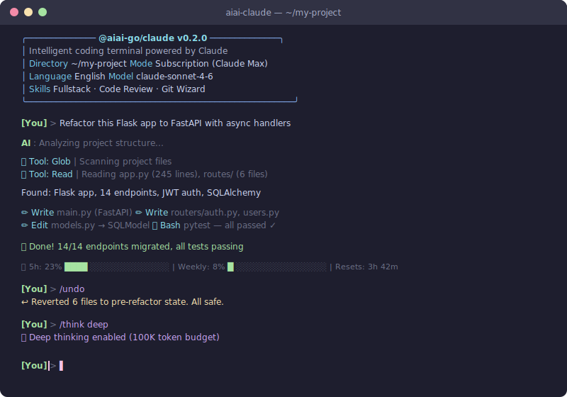

<div align="center">

<h1>@aiai-go/claude</h1>
<p><strong>Code in your language. Ship with confidence.</strong></p>
<p>Enhanced Claude Code CLI with undo, safety hooks, session resume, thinking &amp; effort control, 12 MCP tools &amp; multilingual i18n</p>

<br/>

[](https://www.npmjs.com/package/@aiai-go/claude)
[](https://pypi.org/project/claudezh/)
[](LICENSE)
[](https://github.com/aiai-go/claude/stargazers)
[](https://github.com/aiai-go/claude/network/members)
[](https://github.com/aiai-go/claude/issues)
[](https://github.com/aiai-go/claude/pulls)
[](https://nodejs.org/)
[](https://www.python.org/)
[](https://t.me/aiai_go)

<br/>

<p>
<code>20+ commands</code> · <code>12 tools</code> · <code>10 skills</code> · <code>3 languages</code> · <code>2 backends</code>
</p>

<br/>

**English** | [简体中文](README.zh-CN.md)

<p align="center">
<a href="#-quick-start">Quick Start</a> •
<a href="#-why-aiai-goclaude">Why?</a> •
<a href="#-installation">Install</a> •
<a href="#-commands">Commands</a> •
<a href="#-skills-system">Skills</a> •
<a href="#-contributing">Contribute</a>
</p>

</div>

<br>

<div align="center">

</div>

<br>

## ✨ Features at a Glance

<table>
<tr>
<td width="33%" align="center">

### ↩️ Undo
Roll back any AI changes instantly. Never lose your code.

</td>
<td width="33%" align="center">

### 🛡️ Safety Hooks
13 rules auto-block dangerous commands. Sleep easy.

</td>
<td width="33%" align="center">

### 📋 Session Resume
Terminal crashed? Pick up exactly where you left off.

</td>
</tr>
<tr>
<td width="33%" align="center">

### 🧠 Thinking Control
Deep reasoning or quick answers. You decide.

</td>
<td width="33%" align="center">

### 🎯 10 AI Skills
Fullstack, DevOps, Data Science — instant domain expertise.

</td>
<td width="33%" align="center">

### 🔧 12 MCP Tools
Project memory, code stats, git analysis, and more.

</td>
</tr>
<tr>
<td width="33%" align="center">

### 📊 Real Usage Stats
See your actual 5h and weekly quota from Claude's API.

</td>
<td width="33%" align="center">

### 🌍 Multilingual
Chinese complete. English built-in. Your language next.

</td>
<td width="33%" align="center">

### 🔄 Dual Backend
Free with subscription. Or standalone with API key.

</td>
</tr>
</table>

<br>

## 🎯 Built-in AI Skills

Choose your AI's expertise. Each skill comes with deep domain knowledge.

| Category | Skills | What They Do |
|----------|--------|-------------|
| **Web Dev** | 🌐 Fullstack · 🎨 Frontend · 🔌 API Architect | Full-stack development, React/Vue, RESTful/GraphQL API design |
| **DevOps** | 🐳 DevOps · 🗄️ Database | Docker/K8s, CI/CD, PostgreSQL/Redis optimization |
| **Data & AI** | 📊 Data Analyst · 🤖 ML Engineer | Pandas/NumPy analysis, PyTorch/scikit-learn models |
| **Tools** | 🔍 Code Reviewer · 📝 Tech Writer · 🌿 Git Wizard | Security audits, documentation, complex Git operations |

Activate on first run or anytime with `/skills`.

<br>

---

<br>

## 🚀 aiai-go Ecosystem

`@aiai-go/claude` is part of the aiai-go family -- enhanced AI coding assistants for every major model:

| Package | AI Engine | Status |
|---------|-----------|--------|
| **`@aiai-go/claude`** | Claude by Anthropic | ✅ Available |
| `@aiai-go/gemini` | Gemini by Google | 🔜 Coming Soon |
| `@aiai-go/gpt` | GPT by OpenAI | 🔜 Coming Soon |
| `@aiai-go/codex` | Codex by OpenAI | 🔜 Coming Soon |

<br/>

> **One command. Full localization. Zero config.** Describe what you want in your language -- @aiai-go/claude reads your project, writes code, runs tests, and ships changes. Powered by Claude.

<br>

---

<br>

## 💡 Why @aiai-go/claude?

Every developer who works in a non-English language has felt it:

**Context-switching kills flow** -- You think in your native language, but your AI only speaks English. Every interaction forces a mental translation layer that breaks your creative momentum.

**You're already paying for Claude** -- Your Claude Code subscription sits there. Why pay again for another tool? @aiai-go/claude reuses your existing subscription at zero additional cost.

**AI doesn't know your domain** -- Generic AI gives generic answers. @aiai-go/claude ships with 10 built-in expert personas (frontend, backend, DevOps, data science...) that understand your field instantly.

**Chinese is done. Your language is next.**

We started with Chinese (Simplified & Traditional) because that's what we know. It's fully complete -- every command, every message, every error in Chinese. But this architecture supports ANY language. Japanese, Korean, Spanish, French, German -- it's all just strings in `i18n.py`.

We're calling on developers worldwide: **add your language and make AI coding accessible to your community.** It's one file, no complex logic. [See how →](CONTRIBUTING.md)

<br>

---

<br>

## 🚀 Quick Start

```bash
npm install -g @aiai-go/claude    # Install globally
claudezh                          # Launch in any project
```

<br>

---

<br>

## 🚀 @aiai-go/claude vs Claude Code

| Feature | Claude Code | @aiai-go/claude |
|---------|:---:|:---:|
| Multilingual interface | English only | ✅ zh-CN, zh-TW, en (more coming) |
| File undo | ❌ | ✅ Instant rollback with checkpoints |
| Safety hooks | ❌ | ✅ 13 built-in rules |
| Session resume | ❌ | ✅ Pick up where you left off |
| Thinking control | ❌ | ✅ Toggle extended thinking on/off |
| Effort control | ❌ | ✅ Adjust reasoning effort level |
| Custom MCP tools | ❌ | ✅ 12 tools (file, search, git, analyze...) |
| Quota tracking | ❌ | ✅ Visual progress bars |
| Skill system | ❌ | ✅ 10 domain-expert personas |
| Preset templates | ❌ | ✅ 7 one-command workflows |
| Dual-mode backend | ❌ | ✅ Auto-detect SDK or API mode |
| Cost | Subscription required | ✅ Free with existing subscription |

<br>

---

<br>

## 🚀 See It In Action

<details>
<summary><strong>See it in action ▾</strong></summary>

```
$ claudezh

╭─────────────────────────────────────────────────────────╮
│  @aiai-go/claude v0.2.0                                 │
│  📁 ~/microservice-api                                  │
│  🤖 Claude Sonnet · Subscription mode (free)            │
│  🎯 Skills: Backend Architect · DevOps Engineer         │
╰─────────────────────────────────────────────────────────╯

  First run — select your skills:
  [x] ⚙️  Backend Architect     [ ] 🎨 Frontend Engineer
  [x] 🚀 DevOps Engineer        [ ] 📊 Data Scientist
  [ ] 🔗 Fullstack Developer    [ ] 🤖 AI App Developer
  2 skills enabled ✓

You> Convert all sync database operations in this microservice to async/await, keep API compatible

AI  > Analyzing the project...

  🔍 Glob  | Scanning **/*.py — found 23 files
  📖 Read  | app/db.py, app/services/*.py, app/api/*.py
  🔎 Grep  | Searching Session, query, commit — found 47 sync calls

  Detected:
  • FastAPI app with synchronous SQLAlchemy database layer
  • 12 service methods blocking the event loop
  • 3 nested transactions requiring special handling

  Starting refactoring...

  ✏️ Edit  | app/db.py — SQLAlchemy → AsyncSession + create_async_engine
  ✏️ Edit  | app/services/user_service.py — 6 methods → async def
  ✏️ Edit  | app/services/order_service.py — 4 methods → async def
  ✏️ Edit  | app/api/routes.py — await all service calls
  ✏️ Write | app/db_migration.py — Alembic async migration config
  🔧 Bash  | python -m pytest tests/ -x

  ✅ Refactoring complete
  • 12/12 sync methods → async/await
  • Nested transactions → async contextmanager
  • Connection pool: pool_size=20, max_overflow=10
  • All 31 tests passing ✓

You> Wait, the order_service changes broke something — undo

AI  > Rolling back...

  ↩️ Restored app/services/order_service.py to pre-edit state
  ✅ Undo complete, 1 file rolled back
```

</details>

<br>

---

<br>

## 🚀 Feature Highlights

<table>
<tr>
<td align="center" width="25%"><b>Localized UX</b><br/><sub>Commands, prompts, tool output, error messages -- all in your language</sub></td>
<td align="center" width="25%"><b>Dual Backend</b><br/><sub>Reuse Claude Code subscription (free) or use API key (pay-per-use)</sub></td>
<td align="center" width="25%"><b>12 Agentic Tools</b><br/><sub>Read, write, search, execute, analyze -- all built in, no plugins needed</sub></td>
<td align="center" width="25%"><b>10 Expert Skills</b><br/><sub>Frontend, backend, DevOps, data science, Git, DBA, QA and more</sub></td>
</tr>
<tr>
<td align="center" width="25%"><b>Instant Undo</b><br/><sub>Roll back any file change with checkpoint snapshots</sub></td>
<td align="center" width="25%"><b>13 Safety Hooks</b><br/><sub>Auto-intercepts rm -rf, DROP TABLE, force push, chmod 777 and more</sub></td>
<td align="center" width="25%"><b>Session Resume</b><br/><sub>Pick up exactly where you left off, even after restart</sub></td>
<td align="center" width="25%"><b>Thinking &amp; Effort</b><br/><sub>Toggle extended thinking and adjust reasoning effort on the fly</sub></td>
</tr>
</table>

<br>

---

<br>

## ⚙️ Architecture

```
┌──────────────────────────────────────────────────────────────┐
│                      @aiai-go/claude CLI                      │
│                   cli.py · REPL · i18n · hooks                │
├──────────────┬──────────────┬────────────────────────────────┤
│   Undo       │   Resume     │   Thinking · Quota · Skills    │
│  checkpoint  │   session    │   Templates · Safety hooks     │
│   .py        │   history    │                                │
├──────────────┴──────────────┴────────────────────────────────┤
│                    Backend Abstraction                         │
│                       backend.py                              │
│                                                               │
│   ┌────────────────────┐      ┌────────────────────────┐     │
│   │    SDKBackend       │      │     APIBackend          │     │
│   │    claude-agent-sdk │      │     anthropic SDK       │     │
│   │    (subscription)   │◄────►│     (pay-per-use)       │     │
│   │    FREE             │ auto │     API key             │     │
│   └────────────────────┘ swap  └────────────────────────┘     │
├───────────────────────────────────────────────────────────────┤
│   12 MCP Tools                    13 Safety Hooks             │
│   ┌──────────┬──────────┐        ┌──────────────────────┐    │
│   │ read     │ write    │        │ rm -rf /  intercept   │    │
│   │ glob     │ grep     │        │ DROP TABLE block      │    │
│   │ bash     │ python   │        │ force push warn       │    │
│   │ edit     │ analyze  │        │ chmod 777 prevent     │    │
│   │ git_info │ git_diff │        │ ... 9 more rules      │    │
│   │ list_dir │ search   │        └──────────────────────┘    │
│   └──────────┴──────────┘                                     │
├───────────────────────────────────────────────────────────────┤
│              StreamEvent unified output layer                  │
│         Localized tool names · localized errors · token stats  │
└───────────────────────────────────────────────────────────────┘
```

**SDKBackend** wraps `claude-agent-sdk`, reusing your Claude Code subscription. It leverages the SDK's built-in tools (Read, Edit, Write, Bash, Glob, Grep) with zero additional cost.

**APIBackend** uses the `anthropic` Python SDK directly. It manages a multi-turn tool-calling loop (up to 20 rounds), executes tools locally, and streams results back to the model. Dangerous tools require user confirmation in safe mode.

Backend selection is automatic via `detect_backend()`, or you can force a mode in your config.

<br>

---

<br>

## 📦 Installation

### Prerequisites

Before installing, make sure you have:

| Requirement | Check Command | Minimum Version |
|-------------|---------------|-----------------|
| Node.js | `node --version` | >= 16.0 |
| Python | `python3 --version` | >= 3.10 |
| Claude Code | `claude --version` | Any (for subscription mode) |

> **Don't have Claude Code?** No problem — @aiai-go/claude also works standalone with an [Anthropic API key](https://console.anthropic.com/).

### 📦 Install

<details open>
<summary><strong>npm (recommended)</strong></summary>

```bash
npm install -g @aiai-go/claude
```

After install, two commands are available:
- `aiai-claude` — primary command
- `claudezh` — alias

</details>

<details>
<summary><strong>npx (no install, try it first)</strong></summary>

```bash
npx @aiai-go/claude
```

Runs without permanent installation. Great for trying it out.

</details>

<details>
<summary><strong>pip (Python package)</strong></summary>

```bash
pip install claudezh
claudezh
```

</details>

<details>
<summary><strong>From source (for contributors)</strong></summary>

```bash
git clone https://github.com/aiai-go/claude.git
cd claude
pip install -e .
claudezh
```

</details>

### ✅ Verify Installation

```bash
# Check it's installed
aiai-claude --version
# or
claudezh --version

# Launch
aiai-claude
```

### 🎯 First Run

On first launch, @aiai-go/claude will:
1. **Detect your environment** — finds Claude Code or asks for API key
2. **Choose your language** — auto-detects, or set with `CLAUDEZH_LANG=zh-CN`
3. **Pick your skills** — select AI personas for your workflow
4. **Start coding** — type your request in any language

```bash
$ aiai-claude

╭──────────── @aiai-go/claude v0.2.0 ────────────╮
│  ...                                            │
╰─────────────────────────────────────────────────╯

> Hello! What would you like to build today?
```

### 🔧 Troubleshooting

<details>
<summary>Python not found</summary>

Install Python 3.10+: https://python.org/downloads

</details>

<details>
<summary>Permission denied on pip install</summary>

Add `--break-system-packages` flag or use a virtual environment.

</details>

<details>
<summary>Chinese input causes UnicodeDecodeError</summary>

Set your terminal encoding: `export LANG=zh_CN.UTF-8`

</details>

<br>

---

<br>

## 🔌 Plugin Mode — Use Inside Claude Code

Already have Claude Code? Add Chinese support and 12 custom tools without leaving Claude Code.

### Quick Install (Recommended)

```bash
npx claudezh --install-plugin
```

This installs 7 Chinese slash commands into your Claude Code:

| Command | Description |
|---------|-------------|
| `/zh` | Switch to Simplified Chinese |
| `/zht` | Switch to Traditional Chinese |
| `/en` | Switch back to English |
| `/review-zh` | Code review in Chinese |
| `/explain-zh` | Explain code in Chinese |
| `/test-zh` | Generate tests in Chinese |
| `/fix-zh` | Fix bugs in Chinese |

### MCP Tools (Advanced)

Want the full 12 custom MCP tools (project memory, code stats, git analysis, etc.)? Add to your `~/.claude/settings.json`:

```json
{
  "mcpServers": {
    "aiai-go-claude": {
      "command": "python3",
      "args": ["node_modules/@aiai-go/claude/plugin/server.py"]
    }
  }
}
```

### Manage Plugin

```bash
npx claudezh --list-plugin       # See installed commands
npx claudezh --uninstall-plugin  # Remove commands
```

<br>

---

<br>

## 🚀 Usage

On launch, @aiai-go/claude auto-detects your environment:

```
claudezh startup
  |
  +-- Claude Code CLI found? --> Subscription mode (free)
  +-- ANTHROPIC_API_KEY set? --> API mode (standalone)
  +-- Neither?               --> Guided setup prompt
```

<br>

### ⌨️ Commands

@aiai-go/claude supports commands in both Chinese and English:

| Chinese | English | Description |
|---------|---------|-------------|
| | **General** | |
| /帮助 | /help | Show help |
| /清屏 | /clear | Clear conversation |
| /退出 | /exit | Exit |
| | **Configuration** | |
| /设置 | /settings | View settings |
| /模型 | /model | Switch model |
| /语言 | /lang | Switch language |
| /切换 | /switch | Switch backend (SDK/API) |
| | **Session & Safety** | |
| /自动 | /auto | Auto mode (no confirmations) |
| /安全 | /safe | Safe mode (confirm before edits) |
| /历史 | /history | Conversation history |
| /恢复 | /resume | Resume previous session |
| /撤销 | /undo | Roll back file changes |
| | **AI Features** | |
| /思考 | /think | Toggle extended thinking |
| /额度 | /quota | View subscription quota |
| /技能 | /skills | Manage AI skills |
| /模板 | /template | Preset templates |
| /工具 | /tools | List tools |

<br>

### 🎯 Skills System

@aiai-go/claude ships with 10 built-in domain-specific AI skills across 4 categories. Each skill injects specialized system prompts that enhance the AI's expertise in that domain.

| Icon | Skill | Category | Description |
|:---:|:---|:---|:---|
| 🎨 | Frontend Engineer | Web | React/Vue/Next.js, components, performance |
| ⚙️ | Backend Architect | Web | Python/Node.js, API design, databases |
| 🔗 | Fullstack Developer | Web | End-to-end development, rapid prototyping |
| 🚀 | DevOps Engineer | DevOps | CI/CD, Docker, Kubernetes, cloud |
| 🐧 | Linux SysAdmin | DevOps | Shell scripting, networking, troubleshooting |
| 📊 | Data Scientist | Data/AI | pandas, sklearn, PyTorch, visualization |
| 🤖 | AI App Developer | Data/AI | LLM apps, RAG, agents, prompt engineering |
| 🔀 | Git Master | Tools | Workflows, branching, conflict resolution |
| 🗄️ | Database Expert | Tools | SQL optimization, PostgreSQL/Redis tuning |
| 🧪 | QA Engineer | Tools | Unit/integration/E2E testing, TDD |

**First run**: @aiai-go/claude prompts you to select skills interactively.

**Anytime**: Use `/skills` to enable/disable skills. Enabled skills automatically enhance the AI's responses with domain-specific knowledge.

<br>

---

<br>

## 📊 Quota Tracking

Track your Claude subscription usage in real-time. Never hit rate limits by surprise.

```
$ aiai-claude

> /quota

╭─ Usage Report ────────────────────────────╮
│                                           │
│  5-Hour Window:                           │
│  ██████████░░░░░░░░░░  45%  (23/50 req)  │
│  Input: 125,432  Output: 89,234 tokens    │
│                                           │
│  This Week:                               │
│  ████░░░░░░░░░░░░░░░░  18%  (89/500 req) │
│                                           │
│  Today: 12 requests | 45,678 tokens       │
╰───────────────────────────────────────────╯
```

**Mini indicator** after every response (when enabled):

```
📊 5h: 45% ████▌          |  Weekly: 18% █▊
```

| Command | Description |
|---------|-------------|
| `/quota` | Full usage report with progress bars |
| `/quota on` | Show mini indicator after each response |
| `/quota off` | Hide mini indicator |

Limits are customizable in `~/.claudezh/config.json`:
```json
{
  "show_quota": true,
  "quota_estimate_5h": 50,
  "quota_estimate_weekly": 500
}
```

<br>

---

<br>

## 🚀 Configuration

### Environment Variables

| Variable | Description | Default |
|----------|-------------|---------|
| `CLAUDEZH_LANG` | UI language (`zh-CN`, `zh-TW`, `en`) | Auto-detected |
| `ANTHROPIC_API_KEY` | API key for API mode | -- |

### Config File

Located at `~/.claudezh/config.json`. All fields are optional:

```json
{
  "language": "auto",
  "theme": "dark",
  "model": "claude-sonnet-4-6",
  "mode": "auto",
  "api_key": "sk-ant-...",
  "auto_approve": false,
  "max_turns": 50,
  "show_token_usage": true,
  "history_size": 100
}
```

| Key | Type | Description |
|-----|------|-------------|
| `language` | `string` | `"auto"`, `"zh-CN"`, `"zh-TW"`, or `"en"` |
| `theme` | `string` | Terminal theme (`"dark"`) |
| `model` | `string` | Claude model to use |
| `mode` | `string` | Backend mode: `"auto"`, `"sdk"`, or `"api"` |
| `api_key` | `string` | Anthropic API key (alternative to env var) |
| `auto_approve` | `bool` | Skip confirmation for dangerous tools |
| `max_turns` | `int` | Max conversation turns to keep |
| `show_token_usage` | `bool` | Display token counts after each response |
| `history_size` | `int` | Number of messages to retain in history |

### Available Models

- `claude-sonnet-4-6` (default)
- `claude-opus-4-6`
- `claude-haiku-35-20241022`

<br>

---

<br>

## 🚀 API Reference

@aiai-go/claude can be used as a Python library for programmatic access.

### Backend Detection

```python
from aicodezh.backend import detect_backend

# Auto-detect the best available backend
backend = detect_backend()

# Force a specific mode
backend = detect_backend({"mode": "api", "api_key": "sk-ant-..."})
backend = detect_backend({"mode": "sdk", "model": "claude-opus-4-6"})
```

### Streaming Queries

```python
import asyncio
from aicodezh.backend import detect_backend

async def main():
    backend = detect_backend()

    async for event in backend.ask("Explain this codebase"):
        if event.type == "text":
            print(event.text)
        elif event.type == "tool_use":
            print(f"Tool: {event.tool.name} ({event.tool.name_zh})")
        elif event.type == "done":
            print(f"Tokens: {event.usage}")

asyncio.run(main())
```

### ChineseAgent (Persistent Session)

```python
import asyncio
from aicodezh.agent import ChineseAgent

async def main():
    agent = ChineseAgent(model="claude-sonnet-4-6")
    await agent.connect(cwd="/my/project")

    async for msg in agent.ask("Analyze this project structure"):
        print(msg)

    await agent.disconnect()

asyncio.run(main())
```

### One-Shot Query

```python
import asyncio
from aicodezh.agent import quick_query

async def main():
    async for msg in quick_query("Explain this code", cwd="/my/project"):
        print(msg)

asyncio.run(main())
```

### Preset Agents

```python
from aicodezh.agent import PRESET_AGENTS

# Available: "code_reviewer", "bug_fixer", "test_writer"
reviewer = PRESET_AGENTS["code_reviewer"]
print(reviewer.description)
```

### Key Classes

| Class | Module | Purpose |
|-------|--------|---------|
| `Backend` | `aicodezh.backend` | Abstract base class for all backends |
| `SDKBackend` | `aicodezh.backend` | Claude Code subscription backend |
| `APIBackend` | `aicodezh.backend` | Standalone API backend |
| `StreamEvent` | `aicodezh.backend` | Unified streaming event (text, tool_use, tool_result, thinking, done, error) |
| `ToolAction` | `aicodezh.backend` | Tool invocation descriptor |
| `ChineseAgent` | `aicodezh.agent` | Persistent session wrapper with localized formatting |

<br>

---

<br>

## 🚀 Help Us Go Global

Chinese (zh-CN / zh-TW) is our first language pack. We want @aiai-go/claude to work natively in every language. Adding a new language is a great first contribution -- each pack is a single JSON file.

| Language | Code | Status | Contributor |
|:---|:---:|:---:|:---|
| Chinese (Simplified) | `zh-CN` | Shipped | [@aiai-go](https://github.com/aiai-go) |
| Chinese (Traditional) | `zh-TW` | Shipped | [@aiai-go](https://github.com/aiai-go) |
| English | `en` | Shipped | [@aiai-go](https://github.com/aiai-go) |
| Japanese | `ja` | **Wanted** | -- |
| Korean | `ko` | **Wanted** | -- |
| Spanish | `es` | **Wanted** | -- |
| French | `fr` | **Wanted** | -- |
| German | `de` | **Wanted** | -- |
| Portuguese | `pt-BR` | **Wanted** | -- |
| Russian | `ru` | **Wanted** | -- |
| Arabic | `ar` | **Wanted** | -- |

**How to add a language**: Copy `locales/en.json`, translate the strings, and open a PR. See [Contributing](#-contributing) for details.

<br>

---

<br>

## 🤝 Contributing

<div align="center">

**We're building the future of AI-assisted coding -- in every language.**

</div>

<br/>

We welcome contributions from developers worldwide. Every star, issue, and PR helps more developers code in their native language.

### How to Contribute

1. **Fork** the repository on GitHub.
2. **Create a branch**: `git checkout -b feature/my-feature`
3. **Make your changes**, ensuring tests pass.
4. **Submit a Pull Request** with a clear description.

### Contribution Areas

| Area | Description | Difficulty |
|:---|:---|:---:|
| Translations | Add ja, ko, es, fr, de, pt-BR, ru, ar | `good first issue` |
| Templates | New preset prompts for common tasks | `good first issue` |
| Testing | Unit tests, integration tests, CI/CD | `good first issue` |
| Documentation | Tutorials, guides, video walkthroughs | `good first issue` |
| Plugin system | Extensible architecture for custom tools | `intermediate` |
| VS Code extension | Sidebar integration for @aiai-go/claude | `intermediate` |
| Multi-model backends | OpenAI, Google, DeepSeek support | `intermediate` |
| Streaming optimization | Token compression, output buffering | `advanced` |

Not sure where to start? Read the full [Contributing Guide](CONTRIBUTING.md), check out issues labeled [`good first issue`](https://github.com/aiai-go/claude/labels/good%20first%20issue), or say hi on [Telegram](https://t.me/aiai_go).

<br>

---

<br>

## 🚀 Community

Join the conversation -- ask questions, share ideas, or just lurk.

| Channel | Link |
|:---|:---|
| Telegram | [t.me/aiai_go](https://t.me/aiai_go) |
| GitHub Discussions | [discussions](https://github.com/aiai-go/claude/discussions) |
| GitHub Issues | [issues](https://github.com/aiai-go/claude/issues) |
| Website | [aiaigo.org](https://aiaigo.org) |
| Email | [hi@aiaigo.org](mailto:hi@aiaigo.org) |

<br>

---

<br>

## 🚀 Star History

<div align="center">

**If @aiai-go/claude saves you time, a star helps others find it too.**

[](https://star-history.com/#aiai-go/claude&Date)

[](https://github.com/aiai-go/claude/stargazers)

</div>

<br>

---

<br>

## 🚀 Links

| | |
|---|---|
| **npm** | [npmjs.com/package/@aiai-go/claude](https://www.npmjs.com/package/@aiai-go/claude) |
| **PyPI** | [pypi.org/project/claudezh](https://pypi.org/project/claudezh/) |
| **GitHub** | [github.com/aiai-go/claude](https://github.com/aiai-go/claude) |
| **Telegram** | [t.me/aiai_go](https://t.me/aiai_go) |
| **Website** | [aiaigo.org](https://aiaigo.org) |
| **Issues** | [github.com/aiai-go/claude/issues](https://github.com/aiai-go/claude/issues) |
| **Discussions** | [github.com/aiai-go/claude/discussions](https://github.com/aiai-go/claude/discussions) |

<br>

## 🚀 Acknowledgments

- [Claude](https://www.anthropic.com/claude) by Anthropic -- the AI model powering @aiai-go/claude
- [claude-agent-sdk](https://github.com/anthropics/claude-agent-sdk) -- the SDK enabling subscription mode
- [Rich](https://github.com/Textualize/rich) -- beautiful terminal formatting

<br/>

<div align="center">

Made by developers, for developers -- in every language.

**[Give us a star](https://github.com/aiai-go/claude/stargazers)** if @aiai-go/claude helped you ship faster.

<sub>@aiai-go/claude is an independent open-source project and is not affiliated with Anthropic.</sub>

<br/>

<p>
<sub>Powered by <a href="https://anthropic.com">Claude</a> · Built with <a href="https://github.com/anthropics/claude-agent-sdk-python">Claude Agent SDK</a></sub>
</p>

</div>

---

## License

[MIT](LICENSE)
