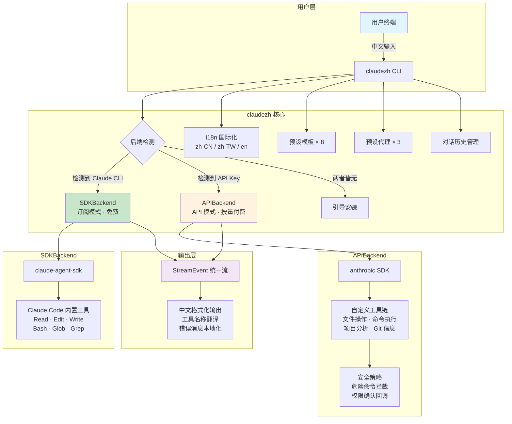

<div align="center">

```
       _                 _          _
   ___| | __ _ _   _  __| | ___ ___| |__
  / __| |/ _` | | | |/ _` |/ _ \_  / '_ \
 | (__| | (_| | |_| | (_| |  __// /| | | |
  \___|_|\__,_|\__,_|\__,_|\___/___|_| |_|

  全 中 文  A I  编 程 助 手
```

<h3>在终端用中文写代码，就像跟一个资深工程师对话一样自然。</h3>

<br/>

[](https://www.npmjs.com/package/claudezh)
[](https://pypi.org/project/claudezh/)
[](LICENSE)
[](https://github.com/whaleaicode/claudezh/stargazers)
[](https://nodejs.org/)
[](https://www.python.org/)

<br/>

[English](#english) | **简体中文**

<br/>


<sub>上图：在终端中用中文描述需求 → AI 自动分析项目结构 → 生成/修改代码 → 执行验证</sub>

</div>

<br/>

## 简体中文

### 为什么需要 claudezh？

**Claude Code 很强大，但它是英文的。**

你需要用英文描述需求、阅读英文输出、理解英文工具提示。对于中文开发者来说，这中间隔了一层翻译成本——不是语言能力的问题，而是思维切换的效率问题。

**claudezh 做的事情很简单：让你用中文思考、中文表达、中文获得反馈。**

- 命令是中文的：`/帮助`、`/模板`、`/自动`
- 工具提示是中文的："读取文件"、"执行命令"、"搜索内容"
- AI 回答是中文的：代码注释、分析报告、错误解释，全部中文输出
- 预设模板是中文的：代码审查、Bug 修复、Amazon Listing 生成...

而且，**如果你已经订阅了 Claude Code，claudezh 完全免费**——它直接复用你的订阅，零额外成本。

<br/>

### 核心特性

| 特性 | 说明 |
|:---|:---|
| **全中文交互** | 命令、提示、输出、工具名称，全部中文化 |
| **双模式架构** | 订阅模式（复用 Claude Code，免费）+ API 模式（独立运行，按量付费） |
| **智能工具链** | 文件读写、代码搜索、命令执行、项目分析、Git 状态，开箱即用 |
| **8 套预设模板** | 代码生成、代码审查、Bug 修复、重构、测试、解释、翻译、Amazon Listing |
| **3 个预设代理** | 代码审查员、Bug 修复师、测试工程师——各司其职 |
| **三语支持** | 简体中文 / 繁体中文 / English，随时切换 |
| **安全权限控制** | 安全模式（危险操作前确认） / 自动模式（全自动执行） |
| **对话历史** | 自动保存、加载、压缩，跨会话连续工作 |
| **项目感知** | 自动检测项目类型、语言、框架，给出更精准的建议 |
| **危险命令拦截** | 内置安全策略，自动拦截 `rm -rf` 等危险操作 |

<br/>

### 架构设计



<details>
<summary><b>文字版架构图（Mermaid 不渲染时查看）</b></summary>

```
claudezh 启动
│
├── 检测本机环境
│   ├── 发现 claude CLI ──→ SDKBackend（订阅模式，免费）
│   │   └── claude-agent-sdk
│   │       └── Read / Edit / Write / Bash / Glob / Grep
│   │
│   ├── 发现 API Key ────→ APIBackend（API 模式，按量付费）
│   │   └── anthropic SDK
│   │       └── 自定义工具链（文件操作 / 命令执行 / 项目分析 / Git）
│   │       └── 安全策略（危险命令拦截 / 权限确认）
│   │
│   └── 两者皆无 ────────→ 引导安装
│
├── 核心模块
│   ├── i18n 国际化 ── zh-CN / zh-TW / en
│   ├── 预设模板 × 8 ── 代码生成 / 审查 / Bug修复 / 重构 / 测试 / 解释 / 翻译 / Listing
│   ├── 预设代理 × 3 ── 审查员 / 修复师 / 测试工程师
│   └── 对话历史 ──── 自动保存 / 加载 / 压缩
│
└── 输出层
    └── StreamEvent 统一流
        └── 中文格式化（工具名翻译 / 错误本地化 / Token 用量统计）
```

</details>

<br/>

### 安装

#### 方式一：npm 全局安装（推荐）

```bash
npm install -g claudezh
```

#### 方式二：npx 免安装运行

```bash
npx claudezh
```

#### 方式三：pip 安装

```bash
pip install claudezh
```

#### 方式四：从源码安装

```bash
# 克隆仓库
git clone https://github.com/whaleaicode/claudezh.git
cd claudezh

# 安装 Python 包（开发模式）
pip install -e .

# 或直接运行
python3 -m aicodezh
```

#### 环境要求

| 依赖 | 版本 | 说明 |
|:---|:---|:---|
| Node.js | >= 16 | npm 安装方式需要 |
| Python | >= 3.10 | 核心运行时 |
| Claude Code | 最新版 | 订阅模式需要（`npm i -g @anthropic-ai/claude-code`） |
| Anthropic API Key | — | API 模式需要（`export ANTHROPIC_API_KEY=sk-ant-...`） |

<br/>

### 快速开始

```bash
# 启动 claudezh
claudezh

# 你会看到这样的欢迎界面：
# ┌─── AI 编程助手  v0.1.0 ──────────────────────┐
# │  基于 Claude 大模型的智能编程终端              │
# │  当前目录: /your/project                      │
# │  语言: 简体中文  |  Model: claude-sonnet-4-6   │
# │  模式: 订阅模式 (Claude Code)                  │
# └───────────────────────────────────────────────┘

# 然后直接用中文对话：
[你] > 帮我看看这个项目的结构
```

<br/>

### 使用示例

#### 场景一：用中文重构一个 Python 项目

```
[你] > 分析这个项目的代码质量，找出需要重构的地方

助手> 我来分析项目结构...
  >> 调用工具: Glob — 搜索文件 **/*.py
  >> 调用工具: Read — 读取文件 app/services/user_service.py
  >> 调用工具: Read — 读取文件 app/api/routes.py
  >> 调用工具: Grep — 搜索内容 "def.*:"

  分析完成，发现以下需要重构的问题：

  1. **app/services/user_service.py** (严重)
     - UserService 类有 420 行，职责过重，建议拆分为 UserAuthService 和 UserProfileService
     - 第 87-102 行有重复的数据库查询逻辑，应抽取为公共方法

  2. **app/api/routes.py** (中等)
     - 路由处理函数直接操作数据库，违反分层原则
     - 建议引入 Service 层，路由只负责参数校验和响应格式化

  需要我开始重构吗？

[你] > 先重构 user_service.py，拆分成两个服务

助手> 好的，我来拆分...
  >> 调用工具: Read — 读取文件 app/services/user_service.py
  >> 调用工具: Write — 写入文件 app/services/user_auth_service.py
  >> 调用工具: Write — 写入文件 app/services/user_profile_service.py
  >> 调用工具: Edit — 编辑文件 app/services/user_service.py
  >> 调用工具: Bash — 执行命令 python3 -m pytest tests/ -x

  重构完成：
  - 创建了 user_auth_service.py（认证相关：登录、注册、JWT、密码重置）
  - 创建了 user_profile_service.py（资料相关：更新资料、头像、偏好设置）
  - 原 user_service.py 保留为向后兼容的门面类
  - 所有 23 个测试通过 ✓
```

#### 场景二：用中文做代码审查

```
[你] > /模板
  1. 代码生成
  2. 代码审查      ← 选这个
  3. Bug修复
  4. 代码重构
  5. 生成测试
  6. 代码解释
  7. Amazon Listing生成
  8. 代码翻译

[你] > 2

>> 已启用模板: 代码审查

[你] > 审查 app/api/ 目录下所有的接口代码

助手> 开始审查...
  >> 调用工具: Glob — 搜索文件 app/api/**/*.py
  >> 调用工具: Read — 读取文件 app/api/auth.py
  >> 调用工具: Read — 读取文件 app/api/orders.py
  >> 调用工具: Read — 读取文件 app/api/products.py

  审查报告（按严重程度排序）：

  🔴 严重
  1. app/api/auth.py:45 — JWT secret 硬编码在源码中
     建议：移到环境变量 `os.environ["JWT_SECRET"]`

  2. app/api/orders.py:128 — SQL 拼接存在注入风险
     `f"SELECT * FROM orders WHERE user_id = {user_id}"`
     建议：使用参数化查询

  🟡 中等
  3. app/api/products.py:67 — 缺少分页参数校验，limit 可传入极大值
     建议：设置最大值限制 `min(limit, 100)`

  4. app/api/auth.py:89 — 登录失败未做频率限制
     建议：引入 rate limiter 或失败计数器

  🟢 建议
  5. 所有接口缺少统一的异常处理中间件
  6. 返回格式不统一，部分用 dict，部分用 Pydantic model
```

#### 场景三：用模板生成 Amazon Listing

```
[你] > /模板
[你] > 7

>> 已启用模板: Amazon Listing生成

[你] > 帮我生成一个无线蓝牙耳机的 listing，主打降噪和长续航，
       目标市场美国，竞品是 AirPods Pro 和 Sony WF-1000XM5，
       价格区间 $49-59，卖点是 45 小时续航和 -42dB 主动降噪

助手> 好的，我来为你生成一个有竞争力的 Amazon Listing：

  📋 **Title**
  Wireless Earbuds Bluetooth 5.3, 45H Playtime Active Noise Cancelling
  Earbuds -42dB ANC, Hi-Fi Stereo Deep Bass, IPX7 Waterproof, Touch
  Control, USB-C Fast Charge, Ear Buds for iPhone Android

  📋 **Bullet Points**
  • 【45-Hour Ultra-Long Battery】...
  • 【-42dB Advanced ANC Technology】...
  • 【Bluetooth 5.3 & Hi-Fi Audio】...
  • 【IPX7 Waterproof & Comfort Fit】...
  • 【Smart Touch & Wide Compatibility】...

  📋 **Description**
  (A+ Content 结构化描述...)

  📋 **Search Terms**
  noise cancelling earphones wireless bluetooth anc...

  💡 **策略说明**（中文）
  - 标题 197 字符，嵌入 12 个高搜索量关键词
  - Bullet Points 按"独特卖点 → 技术参数 → 使用场景"递进
  - 价格区间 $49-59 直接对标 AirPods Pro 的半价策略
  - 搜索词避开了标题中已有的词，最大化索引覆盖
```

#### 场景四：用预设代理自动修 Bug

```
[你] > 用户反馈说点击"提交订单"按钮后页面一直转圈，控制台报
       500 错误，错误信息是 "IntegrityError: duplicate key value
       violates unique constraint order_number_key"

助手> 我来以 Bug 修复师的身份诊断这个问题。
  >> 调用工具: Grep — 搜索内容 "order_number"
  >> 调用工具: Read — 读取文件 app/services/order_service.py
  >> 调用工具: Read — 读取文件 app/models/order.py
  >> 调用工具: Bash — 执行命令 python3 -c "from app.services.order_service import ..."

  🔍 **根因分析**
  在 order_service.py 第 73 行，订单号生成使用了时间戳 + 4位随机数：
  `f"ORD-{datetime.now():%Y%m%d%H%M%S}-{random.randint(1000,9999)}"`

  高并发时（同一秒内多个请求），有概率生成重复订单号。

  🔧 **修复方案**
  >> 调用工具: Edit — 编辑文件 app/services/order_service.py

  将订单号生成改为 UUID + 时间戳方案，彻底消除冲突：
  `f"ORD-{datetime.now():%Y%m%d}-{uuid.uuid4().hex[:8].upper()}"`

  同时添加了重试机制：如果仍然冲突（极小概率），自动重试 3 次。

  >> 调用工具: Bash — 执行命令 python3 -m pytest tests/test_orders.py -x

  ✅ 修复验证：所有测试通过
  ✅ 并发测试：模拟 100 并发创建订单，无冲突
```

<br/>

### 中文命令速查

| 命令 | 英文别名 | 说明 |
|:---|:---|:---|
| `/帮助` | `/help` | 显示所有可用命令 |
| `/清屏` | `/clear` | 清空对话历史，重新开始 |
| `/设置` | `/settings` | 查看当前配置（模型、语言、模式等） |
| `/模型` | `/model` | 切换 AI 模型（Sonnet / Opus / Haiku） |
| `/语言` | `/lang` | 切换界面语言（简中 / 繁中 / English） |
| `/模板` | `/template` | 选择预设模板（代码生成、审查、Listing...） |
| `/工具` | `/tools` | 查看当前可用的工具列表 |
| `/自动` | — | 切换到自动模式（AI 自动执行所有操作） |
| `/安全` | — | 切换到安全模式（危险操作前确认） |
| `/切换` | `/switch` | 在订阅模式和 API 模式之间切换 |
| `/历史` | `/history` | 查看最近的对话记录 |
| `/tokens` | — | 查看 Token 用量统计 |
| `/退出` | `/exit` | 退出程序 |

<br/>

### 配置

配置文件位于 `~/.claudezh/config.json`，支持以下选项：

```jsonc
{
  "language": "zh-CN",        // 界面语言: zh-CN | zh-TW | en | auto
  "model": "claude-sonnet-4-6", // 默认模型
  "mode": "auto",             // 后端模式: auto | sdk | api
  "api_key": "",              // API Key（API 模式需要）
  "auto_approve": false,      // 是否自动批准危险操作
  "max_turns": 50,            // 最大工具调用轮次
  "show_token_usage": true,   // 是否显示 token 用量
  "history_size": 100         // 对话历史保留条数
}
```

也可以通过环境变量设置：

```bash
export CLAUDEZH_LANG=zh-CN         # 界面语言
export ANTHROPIC_API_KEY=sk-ant-...  # API Key（API 模式）
```

<br/>

### 常见问题

<details>
<summary><b>需要付费吗？</b></summary>

**取决于你的使用方式：**

- **订阅模式（推荐）**：如果你已经有 Claude Code 订阅（Max / Team / Enterprise），claudezh 直接复用你的订阅，**不产生任何额外费用**。claudezh 本身是免费开源的。
- **API 模式**：如果你没有 Claude Code 订阅，可以使用 Anthropic API Key，按 token 用量付费。价格参考 [Anthropic 定价页面](https://www.anthropic.com/pricing)。

</details>

<details>
<summary><b>支持哪些模型？</b></summary>

当前支持：
- **Claude Sonnet 4** (`claude-sonnet-4-6`) — 默认，平衡速度和能力
- **Claude Opus 4** (`claude-opus-4-6`) — 最强能力，适合复杂任务
- **Claude Haiku 3.5** (`claude-haiku-35-20241022`) — 最快速度，适合简单任务

使用 `/模型` 命令随时切换。

</details>

<details>
<summary><b>和 Claude Code 是什么关系？</b></summary>

claudezh **不是** Claude Code 的替代品，而是它的**中文增强层**。

- Claude Code 是 Anthropic 官方的 AI 编程 CLI 工具
- claudezh 通过 `claude-agent-sdk` 调用 Claude Code 的能力，在此基础上增加了中文界面、中文命令、中文模板、中文代理等功能
- 如果你没有 Claude Code，claudezh 也可以通过 API 模式独立运行

可以理解为：**claudezh = Claude Code 的能力 + 完整的中文体验**。

</details>

<details>
<summary><b>数据安全吗？</b></summary>

- claudezh 是**完全开源**的，代码公开透明
- **订阅模式**：数据通过 Claude Code CLI 本地处理，不经过 claudezh 的服务器
- **API 模式**：数据直接发送到 Anthropic API，不经过任何中间服务器
- 配置文件（含 API Key）仅保存在本地 `~/.claudezh/` 目录
- claudezh 不收集任何遥测数据、不上报使用信息

**你的代码只在你的机器和 Anthropic 之间流转。**

</details>

<details>
<summary><b>能在 Windows 上运行吗？</b></summary>

可以。claudezh 基于 Python，支持 macOS、Linux、Windows（需要 Python 3.10+）。不过 Windows 上部分 Shell 命令可能需要适配（如 Bash 工具调用）。推荐使用 WSL2 以获得最佳体验。

</details>

<details>
<summary><b>如何更新到最新版本？</b></summary>

```bash
# npm 安装的用户
npm update -g claudezh

# pip 安装的用户
pip install --upgrade claudezh
```

</details>

<br/>

### 横向对比

| 特性 | claudezh | Claude Code | Cursor | GitHub Copilot |
|:---|:---:|:---:|:---:|:---:|
| **中文原生支持** | **全中文** | 英文 | 部分中文 | 英文 |
| **运行环境** | 终端 | 终端 | IDE | IDE 插件 |
| **中文命令** | `/帮助` `/模板` | 英文命令 | 无 CLI | 无 CLI |
| **预设模板** | 8 套（含中文） | 无 | 无 | 无 |
| **预设代理** | 3 个专业角色 | 无 | 无 | 无 |
| **Amazon Listing** | 内置模板 | 无 | 无 | 无 |
| **双模式** | 订阅 + API | 仅订阅 | 订阅 | 订阅 |
| **免费使用** | 复用 Claude 订阅 | 需订阅 | 需订阅 | 需订阅 |
| **开源** | MIT 开源 | 非开源 | 非开源 | 非开源 |
| **工具调用** | 自动 | 自动 | 自动 | 有限 |
| **数据隐私** | 本地处理 | 本地处理 | 云端 | 云端 |
| **可扩展** | 模板/代理可扩展 | 有限 | 插件市场 | 插件市场 |

<br/>

### 路线图

我们正在积极开发以下功能：

- [ ] **插件系统** — 支持社区开发的自定义工具和模板
- [ ] **VS Code 扩展** — 在编辑器侧边栏中使用 claudezh
- [ ] **更多预设模板** — 前端组件生成、API 文档生成、数据库设计...
- [ ] **多模型支持** — 接入 GPT-4、Gemini、DeepSeek 等模型
- [ ] **团队协作** — 共享模板和配置
- [ ] **上下文增强** — 自动索引项目文档、依赖关系
- [ ] **语音输入** — 支持中文语音转文字，解放双手
- [ ] **Web UI** — 浏览器版本，无需终端

<br/>

### 参与贡献

**claudezh 是一个社区驱动的开源项目**，我们热切期待你的参与。

每一个 Star、每一个 Issue、每一个 PR 都在帮助中文开发者获得更好的 AI 编程体验。

#### 如何贡献

```bash
# 1. Fork 本仓库

# 2. 创建功能分支
git checkout -b feature/your-amazing-feature

# 3. 开发并提交
git commit -m "feat: 添加你的功能描述"

# 4. 推送到你的 Fork
git push origin feature/your-amazing-feature

# 5. 创建 Pull Request
```

#### 我们特别需要这些方面的帮助

| 方向 | 说明 | 难度 |
|:---|:---|:---:|
| 更多预设模板 | 微服务架构、React 组件、数据分析... | 入门 |
| 更多语言支持 | 日语、韩语等亚洲语言的 i18n | 入门 |
| 插件系统 | 设计和实现可扩展的插件架构 | 进阶 |
| VS Code 扩展 | 将 claudezh 集成到 VS Code | 进阶 |
| 多模型后端 | 支持 OpenAI、Google、本地模型等 | 进阶 |
| 性能优化 | 流式输出优化、Token 压缩策略 | 进阶 |
| 单元测试 | 提高测试覆盖率 | 入门 |
| 文档改进 | 使用教程、视频录制、最佳实践 | 入门 |

不确定从哪里开始？看看带有 [`good first issue`](https://github.com/whaleaicode/claudezh/labels/good%20first%20issue) 标签的 Issue。

<br/>

### Star History

<div align="center">

[](https://star-history.com/#whaleaicode/claudezh&Date)

</div>

<br/>

### 致谢

- [Anthropic](https://www.anthropic.com/) — 提供 Claude 大模型和 Agent SDK
- [Claude Code](https://docs.anthropic.com/en/docs/claude-code) — 强大的 AI 编程基座
- [Rich](https://github.com/Textualize/rich) — 精美的终端输出

<br/>

<div align="center">

<sub>Made with ❤️ by Chinese developers, for Chinese developers.</sub>

<sub>用热爱构建，为中文开发者而生。</sub>

<br/>

**如果 claudezh 对你有帮助，请给个 Star ⭐ 让更多人知道它。**

[](https://github.com/whaleaicode/claudezh/stargazers)

</div>

---

---

## English

### What is claudezh?

**The first Chinese-native AI coding CLI, built on Claude.**

claudezh brings the full power of Claude to your terminal with a Chinese-first interface. Describe what you need in Chinese (or English) and the AI writes code, edits files, runs commands, and analyzes your project -- all from the command line. It supports both Claude Code subscriptions and standalone API access, automatically detecting the best available backend.

### Why claudezh?

- **Chinese-native experience** -- Commands, prompts, tool output, and error messages are all available in Simplified Chinese, Traditional Chinese, and English. Switch with a single command.
- **Zero-config dual backend** -- If you have a Claude Code subscription, claudezh uses it for free. No subscription? Just set an API key and it works standalone. Backend detection is fully automatic.
- **Built-in agentic tools** -- File read/write, code search (glob + regex), shell execution, Python execution, project analysis, and Git integration are available out of the box.
- **Preset templates & agents** -- Code generation, review, bug fixing, refactoring, test writing, code explanation, Amazon Listing generation, and code translation templates. Specialized sub-agents (code reviewer, bug fixer, test writer) with curated system prompts.
- **Permission control** -- Safe mode (confirms before destructive operations) and auto mode (fully autonomous). Toggle with `/safe` or `/auto`.
- **Trilingual i18n** -- Full interface in `zh-CN`, `zh-TW`, and `en`. Auto-detected from system locale or set via `CLAUDEZH_LANG`.

### Installation

#### npm (recommended)

```bash
npm install -g claudezh
```

#### npx (no install)

```bash
npx claudezh
```

#### pip

```bash
pip install claudezh
```

#### From source

```bash
git clone https://github.com/whaleaicode/claudezh.git
cd claudezh
pip install -e .
```

### System Requirements

- Node.js >= 16 (for npm installation)
- Python >= 3.10
- One of the following:
  - **Claude Code** installed and authenticated (subscription mode -- free)
  - **Anthropic API Key** (API mode -- pay-per-use)

### Quick Start

```bash
claudezh
```

On launch, claudezh auto-detects your environment:

```
claudezh startup
  |
  +-- Claude Code CLI found? --> Subscription mode (free)
  +-- ANTHROPIC_API_KEY set? --> API mode (standalone)
  +-- Neither?               --> Guided setup prompt
```

### Usage Examples

```
[You] > Write a FastAPI user registration endpoint with password hashing and JWT auth

AI   > I'll create that for you...
       Tool: Write | app/auth.py
       Tool: Write | app/models.py
       Done | 2 files created

[You] > /template
       1. Code Generation
       2. Code Review
       3. Bug Fix
       ...

[You] > /auto
       Switched to auto mode -- AI will execute all operations automatically
```

claudezh accepts input in any language. Chinese commands have English aliases:

| Chinese | English | Description |
|---------|---------|-------------|
| /帮助 | /help | Show help |
| /清屏 | /clear | Clear conversation |
| /设置 | /settings | View settings |
| /模型 | /model | Switch model |
| /语言 | /lang | Switch language |
| /模板 | /template | Preset templates |
| /工具 | /tools | List tools |
| /自动 | /auto | Auto mode (no confirmations) |
| /安全 | /safe | Safe mode (confirm before edits) |
| /切换 | /switch | Switch backend (SDK/API) |
| /历史 | /history | Conversation history |
| /退出 | /exit | Exit |

### Architecture

```
┌─────────────────────────────────────────────────┐
│                   claudezh CLI                   │
│              (cli.py — REPL + i18n)              │
├─────────────────────────────────────────────────┤
│              Backend Abstraction                 │
│                 (backend.py)                     │
│                                                  │
│    ┌──────────────┐     ┌──────────────────┐    │
│    │  SDKBackend   │     │   APIBackend      │    │
│    │  claude-agent │     │   anthropic SDK   │    │
│    │  -sdk         │     │   + tool loop     │    │
│    │  (free)       │     │   (pay-per-use)   │    │
│    └──────────────┘     └──────────────────┘    │
├─────────────────────────────────────────────────┤
│    Tools: read_file, write_file, list_files,     │
│    search_in_files, run_command, run_python,     │
│    analyze_project, get_git_info                 │
└─────────────────────────────────────────────────┘
```

**SDKBackend** wraps `claude-agent-sdk`, reusing your Claude Code subscription. It leverages the SDK's built-in tools (Read, Edit, Write, Bash, Glob, Grep) with zero additional cost.

**APIBackend** uses the `anthropic` Python SDK directly. It manages a multi-turn tool-calling loop (up to 20 rounds), executes tools locally, and streams results back to the model. Dangerous tools require user confirmation in safe mode.

Backend selection is automatic via `detect_backend()`, or you can force a mode in your config.

### Configuration

#### Environment Variables

| Variable | Description | Default |
|----------|-------------|---------|
| `CLAUDEZH_LANG` | UI language (`zh-CN`, `zh-TW`, `en`) | Auto-detected |
| `ANTHROPIC_API_KEY` | API key for API mode | -- |

#### Config File

Located at `~/.claudezh/config.json`. All fields are optional:

```json
{
  "language": "auto",
  "theme": "dark",
  "model": "claude-sonnet-4-6",
  "mode": "auto",
  "api_key": "sk-ant-...",
  "auto_approve": false,
  "max_turns": 50,
  "show_token_usage": true,
  "history_size": 100
}
```

| Key | Type | Description |
|-----|------|-------------|
| `language` | `string` | `"auto"`, `"zh-CN"`, `"zh-TW"`, or `"en"` |
| `theme` | `string` | Terminal theme (`"dark"`) |
| `model` | `string` | Claude model to use |
| `mode` | `string` | Backend mode: `"auto"`, `"sdk"`, or `"api"` |
| `api_key` | `string` | Anthropic API key (alternative to env var) |
| `auto_approve` | `bool` | Skip confirmation for dangerous tools |
| `max_turns` | `int` | Max conversation turns to keep |
| `show_token_usage` | `bool` | Display token counts after each response |
| `history_size` | `int` | Number of messages to retain in history |

#### Available Models

- `claude-sonnet-4-6` (default)
- `claude-opus-4-6`
- `claude-haiku-35-20241022`

### API Reference

claudezh can be used as a Python library for programmatic access.

#### Backend Detection

```python
from aicodezh.backend import detect_backend

# Auto-detect the best available backend
backend = detect_backend()

# Force a specific mode
backend = detect_backend({"mode": "api", "api_key": "sk-ant-..."})
backend = detect_backend({"mode": "sdk", "model": "claude-opus-4-6"})
```

#### Streaming Queries

```python
import asyncio
from aicodezh.backend import detect_backend

async def main():
    backend = detect_backend()

    async for event in backend.ask("Explain this codebase"):
        if event.type == "text":
            print(event.text)
        elif event.type == "tool_use":
            print(f"Tool: {event.tool.name} ({event.tool.name_zh})")
        elif event.type == "done":
            print(f"Tokens: {event.usage}")

asyncio.run(main())
```

#### ChineseAgent (Persistent Session)

```python
import asyncio
from aicodezh.agent import ChineseAgent

async def main():
    agent = ChineseAgent(model="claude-sonnet-4-6")
    await agent.connect(cwd="/my/project")

    async for msg in agent.ask("Analyze this project structure"):
        print(msg)

    await agent.disconnect()

asyncio.run(main())
```

#### One-Shot Query

```python
import asyncio
from aicodezh.agent import quick_query

async def main():
    async for msg in quick_query("Explain this code", cwd="/my/project"):
        print(msg)

asyncio.run(main())
```

#### Preset Agents

```python
from aicodezh.agent import PRESET_AGENTS

# Available: "code_reviewer", "bug_fixer", "test_writer"
reviewer = PRESET_AGENTS["code_reviewer"]
print(reviewer.description)  # "Code reviewer -- reviews code quality, finds potential issues"
```

#### Key Classes

| Class | Module | Purpose |
|-------|--------|---------|
| `Backend` | `aicodezh.backend` | Abstract base class for all backends |
| `SDKBackend` | `aicodezh.backend` | Claude Code subscription backend |
| `APIBackend` | `aicodezh.backend` | Standalone API backend |
| `StreamEvent` | `aicodezh.backend` | Unified streaming event (text, tool_use, tool_result, thinking, done, error) |
| `ToolAction` | `aicodezh.backend` | Tool invocation descriptor |
| `ChineseAgent` | `aicodezh.agent` | Persistent session wrapper with Chinese formatting |

### Contributing

We welcome contributions from developers worldwide.

#### How to Contribute

1. **Fork** the repository on GitHub.
2. **Create a branch** for your feature or fix:
   ```bash
   git checkout -b feature/my-feature
   ```
3. **Make your changes**, ensuring tests pass.
4. **Submit a Pull Request** with a clear description.

#### Development Setup

```bash
git clone https://github.com/whaleaicode/claudezh.git
cd claudezh
pip install -e .

# Run the CLI in development mode
claudezh
```

#### Areas Where Help Is Needed

- **Translations** -- Improve existing zh-TW/en translations, add new locales (ja, ko, etc.)
- **Templates** -- Add new preset prompt templates for common tasks
- **Plugins** -- Design and implement a plugin system for custom tools
- **VS Code Extension** -- Build a VS Code extension that wraps claudezh
- **Documentation** -- Tutorials, guides, and API docs
- **Testing** -- Unit tests, integration tests, CI/CD pipeline

#### Code of Conduct

We are committed to providing a welcoming and inclusive environment. Please be respectful in all interactions.

### Acknowledgments

- [Claude](https://www.anthropic.com/claude) by Anthropic -- the AI model powering claudezh
- [claude-agent-sdk](https://github.com/anthropics/claude-agent-sdk) -- the SDK enabling subscription mode
- [Rich](https://github.com/Textualize/rich) -- beautiful terminal formatting

### Links

- **npm**: [npmjs.com/package/claudezh](https://www.npmjs.com/package/claudezh)
- **GitHub**: [github.com/whaleaicode/claudezh](https://github.com/whaleaicode/claudezh)
- **Issues**: [github.com/whaleaicode/claudezh/issues](https://github.com/whaleaicode/claudezh/issues)
- **Discussions**: [github.com/whaleaicode/claudezh/discussions](https://github.com/whaleaicode/claudezh/discussions)

### License

[MIT](LICENSE)
