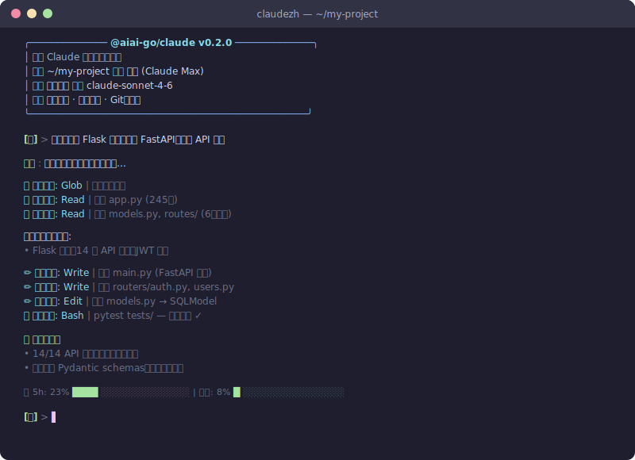

<div align="center">

🌐 [English](README.md) | **简体中文**

<br/>

<h1>@aiai-go/claude</h1>

<h3>用你的语言编程，用你的语言思考</h3>

<p>增强版 Claude Code CLI -- 内置撤销、安全钩子、会话恢复、思维控制与 12 个 Agent 工具</p>

<br/>

[](https://www.npmjs.com/package/@aiai-go/claude)
[](https://pypi.org/project/claudezh/)
[](LICENSE)
[](https://github.com/aiai-go/claude/stargazers)
[](https://github.com/aiai-go/claude/network/members)
[](https://github.com/aiai-go/claude/issues)
[](https://github.com/aiai-go/claude/pulls)
[](https://nodejs.org/)
[](https://www.python.org/)
[](https://t.me/aiai_go)

<br/>

<p>
<code>20+ 命令</code> · <code>18 工具</code> · <code>10 技能</code> · <code>3 种语言</code> · <code>双模式后端</code>
</p>

<br/>

<p align="center">
<a href="#-30-秒快速开始">快速开始</a> •
<a href="#-为什么选-aiai-goclaude">为什么？</a> •
<a href="#-安装">安装</a> •
<a href="#-命令列表">命令</a> •
<a href="#-技能系统">技能</a> •
<a href="#-参与贡献">贡献</a>
</p>

</div>

<br>

<div align="center">

</div>

<br>

## ✨ 功能一览

<table>
<tr>
<td width="33%" align="center">

### ↩️ 即时撤销
一键回滚 AI 的任何修改，代码永远不会丢。

</td>
<td width="33%" align="center">

### 🛡️ 安全钩子
13 条规则自动拦截危险命令，安心交给 AI。

</td>
<td width="33%" align="center">

### 📋 会话恢复
终端崩溃？从断点精确继续。

</td>
</tr>
<tr>
<td width="33%" align="center">

### 🧠 思维控制
深度推理还是快速回答，由你决定。

</td>
<td width="33%" align="center">

### 🎯 10 个 AI 技能
全栈、运维、数据科学——即时领域专家。

</td>
<td width="33%" align="center">

### 🔧 12 个 MCP 工具
项目记忆、代码统计、Git 分析等。

</td>
</tr>
<tr>
<td width="33%" align="center">

### 📊 真实用量统计
查看 Claude API 的 5 小时和每周实际额度。

</td>
<td width="33%" align="center">

### 🌍 多语言支持
中文已完成，英文内置，你的语言即将到来。

</td>
<td width="33%" align="center">

### 🔄 双模式后端
订阅免费用，或 API Key 独立运行。

</td>
</tr>
</table>

<br>

## 🎯 内置 AI 技能

选择 AI 的专业方向，每个技能都注入深度领域知识。

| 方向 | 技能 | 能力范围 |
|------|------|----------|
| **Web 开发** | 🌐 全栈 · 🎨 前端 · 🔌 API 架构 | 全栈开发、React/Vue、RESTful/GraphQL API 设计 |
| **运维部署** | 🐳 DevOps · 🗄️ 数据库 | Docker/K8s、CI/CD、PostgreSQL/Redis 调优 |
| **数据 & AI** | 📊 数据分析 · 🤖 ML 工程 | Pandas/NumPy 分析、PyTorch/scikit-learn 建模 |
| **效率工具** | 🔍 代码审查 · 📝 技术写作 · 🌿 Git 大师 | 安全审计、文档撰写、复杂 Git 操作 |

首次运行自动选择，之后随时用 `/技能` 切换。

<br>

---

<br>

## 🚀 aiai-go 生态

`@aiai-go/claude` 是 **aiai-go** 家族的第一个产品 -- 为主流 AI 模型打造的增强版编程助手：

| 包名 | AI 引擎 | 命令 | 状态 |
|:---|:---|:---|:---:|
| **`@aiai-go/claude`** | Claude (Anthropic) | `claudezh` / `aiai-claude` | ✅ 可用 |
| `@aiai-go/gemini` | Gemini (Google) | `aiai-gemini` | 🔜 即将推出 |
| `@aiai-go/gpt` | GPT (OpenAI) | `aiai-gpt` | 🔜 即将推出 |
| `@aiai-go/codex` | Codex (OpenAI) | `aiai-codex` | 🔜 即将推出 |

统一的命令体系，统一的技能系统，统一的插件生态。选你喜欢的模型，用你熟悉的语言。

<br>

---

<br>

## 🚀 30 秒快速开始

```bash
npm install -g @aiai-go/claude    # 安装
claudezh                          # 启动
```

没有额外配置，没有 API Key 门槛（复用你已有的 Claude Code 订阅），打开终端直接用。

<br>

---

<br>

## 💡 为什么选 @aiai-go/claude

> 不只是翻译，是重新思考 AI 编程助手应该怎么做。

| 能力 | Claude Code (原版) | @aiai-go/claude |
|:---|:---:|:---:|
| 多语言界面 | ❌ 仅 English | ✅ zh-CN / zh-TW / en，社区可扩展 |
| 文件撤销 | ❌ | ✅ `/撤销` 基于 checkpoint 的即时回滚 |
| 安全钩子 | ❌ | ✅ 13 条内置规则，拦截 `rm -rf`、`DROP TABLE`、`force push` 等 |
| 会话恢复 | ❌ | ✅ `/恢复` 终端崩溃后从断点继续 |
| 思维控制 | ❌ | ✅ `/思考` 切换 extended thinking 模式 |
| 推理力度 | ❌ | ✅ 调节推理深度级别 |
| 额度追踪 | ❌ | ✅ `/额度` 可视化进度条 |
| 技能系统 | ❌ | ✅ 10 个领域专家人格，注入领域知识 |
| 预设模板 | ❌ | ✅ 7 套一键工作流 |
| 自定义 MCP 工具 | ❌ | ✅ 12 个 Agent 工具 (文件/搜索/Git/分析...) |
| API 模式降级 | ❌ 仅订阅 | ✅ 自动检测 SDK 或 API 模式 |
| 费用 | ❌ 需订阅 | ✅ 复用已有订阅，免费 |

**中文已完成，你的语言是下一个。**

中文（简体和繁体）是我们做的第一个语言包，也是目前最完整的——每一个命令、每一条提示、每一个错误信息，全部中文化。

但 @aiai-go/claude 的架构支持任何语言。日语、韩语、西班牙语、法语、德语——都只是 `i18n.py` 里的字符串。

我们呼吁全球开发者：**为你的语言社区添加支持，让 AI 编程真正无国界。** 只需要翻译一个文件，不需要复杂的编程知识。[查看指南 →](CONTRIBUTING.md)

<br>

---

<br>

## 🚀 终端演示

<details>
<summary><strong>查看演示 ▾</strong></summary>

```text
$ claudezh

╭─────────────────────────────────────────────────────────╮
│  @aiai-go/claude v0.2.0                                  │
│  ~/microservice-api                                      │
│  Claude Sonnet 4 · 订阅模式 (免费)                         │
│  技能: 后端架构师 · DevOps工程师                            │
╰─────────────────────────────────────────────────────────╯

  首次运行 -- 选择你的技能:
  [x] 后端架构师              [ ] 前端工程师
  [x] DevOps工程师            [ ] 数据科学家
  [ ] 全栈开发者              [ ] AI应用开发者
  已启用 2 个技能

你> 把这个微服务的同步数据库操作全部改成 async/await，保持 API 兼容

助手> 我来分析当前项目...

  Glob  | 扫描 **/*.py -- 找到 23 个文件
  Read  | app/db.py, app/services/*.py, app/api/*.py
  Grep  | 搜索 Session, query, commit -- 找到 47 处同步调用

  检测到:
  * FastAPI 应用，但数据库层使用同步 SQLAlchemy
  * 12 个 service 方法阻塞事件循环
  * 3 个嵌套事务需要特殊处理

  开始重构...

  Edit  | app/db.py -- SQLAlchemy -> AsyncSession + create_async_engine
  Edit  | app/services/user_service.py -- 6 个方法 -> async def
  Edit  | app/services/order_service.py -- 4 个方法 -> async def
  Edit  | app/api/routes.py -- await 所有 service 调用
  Write | app/db_migration.py -- Alembic async 迁移配置
  Bash  | python -m pytest tests/ -x

  重构完成
  * 12/12 同步方法 -> async/await
  * 嵌套事务 -> async contextmanager
  * 连接池: pool_size=20, max_overflow=10
  * 所有 31 个测试通过

你> 等等，order_service 的改动有问题，撤回

助手> 正在撤销...

  已恢复 app/services/order_service.py 到修改前状态
  撤销完成，1 个文件已回滚

你> /额度

  ┌─ 订阅额度 ──────────────────────────────────────┐
  │ 今日已用  ████████░░░░░░░░░░░  42%               │
  │ 剩余请求  1,247 / 2,000                          │
  │ 重置时间  06:00 (8小时后)                         │
  └────────────────────────────────────────────────┘
```

</details>

<br>

---

<br>

## ⚙️ 架构

```
┌───────────────────────────────────────────────────────────────┐
│                      @aiai-go/claude CLI                       │
│                   cli.py · REPL · i18n · hooks                 │
├──────────────┬──────────────┬─────────────────────────────────┤
│   /撤销       │   /恢复       │   /思考  /额度  /技能  /模板      │
│  checkpoint   │   session    │   thinking · quota · skills     │
│   snapshots   │   history    │   templates · safety hooks      │
├──────────────┴──────────────┴─────────────────────────────────┤
│                    Backend Abstraction                          │
│                       backend.py                               │
│                                                                │
│   ┌────────────────────┐      ┌────────────────────────┐      │
│   │    SDKBackend       │      │     APIBackend          │      │
│   │    claude-agent-sdk │      │     anthropic SDK       │      │
│   │    (订阅模式)        │◄────►│     (API 模式)          │      │
│   │    免费              │ auto │     按量付费             │      │
│   └────────────────────┘ swap  └────────────────────────┘      │
├────────────────────────────────────────────────────────────────┤
│   12 Agent Tools                     13 Safety Hooks           │
│   ┌──────────┬──────────┐        ┌──────────────────────┐     │
│   │ read     │ write    │        │ rm -rf /  拦截         │     │
│   │ glob     │ grep     │        │ DROP TABLE 阻断       │     │
│   │ bash     │ python   │        │ force push 警告       │     │
│   │ edit     │ analyze  │        │ chmod 777 阻止        │     │
│   │ git_info │ git_diff │        │ ... 9 条更多规则      │     │
│   │ list_dir │ search   │        └──────────────────────┘     │
│   └──────────┴──────────┘                                      │
├────────────────────────────────────────────────────────────────┤
│              StreamEvent 统一输出层                              │
│         工具名翻译 · 错误本地化 · Token 用量统计                  │
└────────────────────────────────────────────────────────────────┘
```

**SDKBackend** -- 检测到本机安装了 Claude Code 时自动启用，复用你的订阅，调用 SDK 内置工具 (Read/Edit/Write/Bash/Glob/Grep)，零额外费用。

**APIBackend** -- 没有 Claude Code 时自动降级，使用 `anthropic` SDK 直连 API，本地执行工具，安全模式下危险操作需确认。

<br>

---

<br>

## 📦 安装

### 环境要求

| 依赖 | 检查命令 | 最低版本 |
|------|----------|----------|
| Node.js | `node --version` | ≥ 16.0 |
| Python | `python3 --version` | ≥ 3.10 |
| Claude Code | `claude --version` | 任意版本（订阅模式） |

> **没有 Claude Code？** 没关系 — @aiai-go/claude 也支持用 [Anthropic API Key](https://console.anthropic.com/) 独立运行。

### 安装方式

<details open>
<summary><strong>npm 安装（推荐）</strong></summary>

```bash
npm install -g @aiai-go/claude
```

安装后有两个命令可用：
- `aiai-claude` — 主命令
- `claudezh` — 别名

</details>

<details>
<summary><strong>npx 免安装体验</strong></summary>

```bash
npx @aiai-go/claude
```

不需要安装，直接试用。

</details>

<details>
<summary><strong>pip 安装</strong></summary>

```bash
pip install claudezh
claudezh
```

</details>

<details>
<summary><strong>从源码安装（贡献者）</strong></summary>

```bash
git clone https://github.com/aiai-go/claude.git
cd claude
pip install -e .
claudezh
```

</details>

### ✅ 验证安装

```bash
aiai-claude
```

### 🎯 首次运行

首次启动时，@aiai-go/claude 会：
1. **检测环境** — 自动发现 Claude Code 或引导你输入 API Key
2. **选择语言** — 自动检测系统语言，也可以设置 `CLAUDEZH_LANG=zh-CN`
3. **选择技能** — 挑选适合你工作的 AI 技能组合
4. **开始编程** — 用中文描述你的需求，AI 帮你写代码

### 🔧 常见问题

<details>
<summary>找不到 Python</summary>
安装 Python 3.10+: https://python.org/downloads
</details>

<details>
<summary>pip 安装权限错误</summary>
添加 `--break-system-packages` 参数，或使用虚拟环境。
</details>

<details>
<summary>中文输入报 UnicodeDecodeError</summary>
设置终端编码: `export LANG=zh_CN.UTF-8`
</details>

<details>
<summary>启动时提示嵌套会话</summary>
如果在 Claude Code 终端里运行，需要: `env CLAUDECODE= claudezh`
</details>

<br>

---

<br>

## 🔌 插件模式 — 在 Claude Code 中使用

已经安装了 Claude Code？无需离开 Claude Code，即可添加中文支持和 12 个自定义工具。

### 快速安装（推荐）

```bash
npx claudezh --install-plugin
```

安装后，你的 Claude Code 将获得 7 个中文斜杠命令：

| 命令 | 说明 |
|------|------|
| `/zh` | 切换到简体中文 |
| `/zht` | 切换到繁体中文 |
| `/en` | 切换回英文 |
| `/review-zh` | 用中文进行代码审查 |
| `/explain-zh` | 用中文解释代码 |
| `/test-zh` | 用中文生成测试 |
| `/fix-zh` | 用中文修复 Bug |

### MCP 工具（进阶）

想要完整的 12 个自定义 MCP 工具（项目记忆、代码统计、Git 分析等）？在 `~/.claude/settings.json` 中添加：

```json
{
  "mcpServers": {
    "aiai-go-claude": {
      "command": "python3",
      "args": ["node_modules/@aiai-go/claude/plugin/server.py"]
    }
  }
}
```

### 管理插件

```bash
npx claudezh --list-plugin       # 查看已安装的命令
npx claudezh --uninstall-plugin  # 卸载插件
```

<br>

---

<br>

## ⌨️ 命令列表

### 核心命令

| 命令 | 英文别名 | 说明 |
|:---|:---|:---|
| `/帮助` | `/help` | 显示所有可用命令 |
| `/清屏` | `/clear` | 清空对话历史，重新开始 |
| `/退出` | `/exit` | 退出程序 |

<br>

### 模式与配置

| 命令 | 英文别名 | 说明 |
|:---|:---|:---|
| `/设置` | `/settings` | 查看当前配置 (模型、语言、模式) |
| `/模型` | `/model` | 切换 AI 模型 (Sonnet / Opus / Haiku) |
| `/语言` | `/lang` | 切换界面语言 (zh-CN / zh-TW / en) |
| `/切换` | `/switch` | 在订阅模式和 API 模式之间切换 |
| `/自动` | `/auto` | 自动模式 -- AI 自动执行所有操作 |
| `/安全` | `/safe` | 安全模式 -- 危险操作前确认 |

<br>

### 增强功能

| 命令 | 英文别名 | 说明 |
|:---|:---|:---|
| `/撤销` | `/undo` | 基于 checkpoint 的文件回滚 |
| `/恢复` | `/resume` | 会话恢复，从断点继续 |
| `/思考` | `/thinking` | 切换 extended thinking 模式 |
| `/额度` | `/quota` | 订阅额度追踪，可视化进度条 |
| `/技能` | `/skills` | 管理 AI 技能人格 |
| `/模板` | `/template` | 选择预设工作流模板 |
| `/工具` | `/tools` | 查看可用工具列表 |
| `/历史` | `/history` | 查看对话记录 |
| `/tokens` | -- | Token 用量统计 |

<br>

### 预设模板

| 编号 | 模板 | 用途 |
|:---:|:---|:---|
| 1 | 代码生成 | 从需求描述生成完整代码 |
| 2 | 代码审查 | 安全、性能、架构全方位审查 |
| 3 | Bug 修复 | 根因分析 + 修复方案 + 验证 |
| 4 | 代码重构 | 拆分/提取/优化，保持兼容 |
| 5 | 生成测试 | 单元测试 / 集成测试 / E2E |
| 6 | 代码解释 | 逐行解读复杂逻辑 |
| 7 | 代码翻译 | 跨语言迁移 (Python -> Go 等) |

<br>

---

<br>

## 🎯 技能系统

10 个领域专家人格，覆盖 4 大方向。每个技能通过注入领域专属的系统提示，让 AI 在特定领域给出更精准的回答。

### Web 开发

| 技能 | 说明 |
|:---|:---|
| 前端工程师 | React / Vue / Next.js，组件设计，性能优化 |
| 后端架构师 | Python / Node.js，API 设计，数据库建模 |
| 全栈开发者 | 端到端开发，快速原型搭建 |

### 运维部署

| 技能 | 说明 |
|:---|:---|
| DevOps 工程师 | CI/CD、Docker、K8s、云服务 |
| Linux 运维专家 | 系统管理、Shell 脚本、故障排查 |

### 数据 & AI

| 技能 | 说明 |
|:---|:---|
| 数据科学家 | pandas、sklearn、PyTorch、可视化 |
| AI 应用开发者 | LLM 应用、RAG、Agent 架构 |

### 效率工具

| 技能 | 说明 |
|:---|:---|
| Git 大师 | 工作流、分支策略、冲突解决 |
| 数据库专家 | SQL 优化、PostgreSQL / Redis 调优 |
| 测试工程师 | 单元测试、集成测试、TDD |

首次启动自动弹出选择界面，之后随时用 `/技能` 管理：

```
你> /技能

可用技能:
  [x] 后端架构师
  [ ] 前端工程师
  [x] DevOps工程师
  ...

输入编号切换启用/禁用
```

<br>

---

<br>

## 📊 额度追踪

实时追踪 Claude 订阅用量，再也不会突然撞上限额。

```
> /额度

╭─ 额度使用情况 ──────────────────────────╮
│                                          │
│  5小时窗口:                               │
│  ██████████░░░░░░░░░░  45%  (23/50 次)   │
│  输入: 125,432  输出: 89,234 tokens      │
│                                          │
│  本周:                                    │
│  ████░░░░░░░░░░░░░░░░  18%  (89/500 次)  │
│                                          │
│  今日: 12 次 | 45,678 tokens             │
╰──────────────────────────────────────────╯
```

**迷你指示器** -- 每次回答后显示（可开关）：

```
📊 5h: 45% ████▌          |  本周: 18% █▊
```

| 命令 | 说明 |
|------|------|
| `/额度` | 完整使用报告 |
| `/额度 开` | 每次回答后显示迷你指示器 |
| `/额度 关` | 隐藏迷你指示器 |

限额可在 `~/.claudezh/config.json` 自定义：
```json
{
  "show_quota": true,
  "quota_estimate_5h": 50,
  "quota_estimate_weekly": 500
}
```

<br>

---

<br>

## 🚀 全球语言号召

@aiai-go/claude 当前支持 **简体中文 (zh-CN)**、**繁体中文 (zh-TW)** 和 **English (en)**。

语言文件结构清晰，社区可以很容易地添加新语言：

```
aicodezh/i18n/
  ├── zh_CN.json    # 简体中文
  ├── zh_TW.json    # 繁体中文
  └── en.json       # English
```

**我们正在寻找以下语言的贡献者：**

| 语言 | Locale | 状态 | 联系 |
|:---|:---|:---:|:---|
| 日本語 | `ja` | 待认领 | [创建 Issue](https://github.com/aiai-go/claude/issues/new?title=i18n:+Japanese+translation) |
| 한국어 | `ko` | 待认领 | [创建 Issue](https://github.com/aiai-go/claude/issues/new?title=i18n:+Korean+translation) |
| Espanol | `es` | 待认领 | [创建 Issue](https://github.com/aiai-go/claude/issues/new?title=i18n:+Spanish+translation) |
| Francais | `fr` | 待认领 | [创建 Issue](https://github.com/aiai-go/claude/issues/new?title=i18n:+French+translation) |
| Deutsch | `de` | 待认领 | [创建 Issue](https://github.com/aiai-go/claude/issues/new?title=i18n:+German+translation) |
| Portugues (Brasil) | `pt-BR` | 待认领 | [创建 Issue](https://github.com/aiai-go/claude/issues/new?title=i18n:+Portuguese+translation) |
| Русский | `ru` | 待认领 | [创建 Issue](https://github.com/aiai-go/claude/issues/new?title=i18n:+Russian+translation) |
| Tieng Viet | `vi` | 待认领 | [创建 Issue](https://github.com/aiai-go/claude/issues/new?title=i18n:+Vietnamese+translation) |
| العربية | `ar` | 待认领 | [创建 Issue](https://github.com/aiai-go/claude/issues/new?title=i18n:+Arabic+translation) |

每个语言文件大约 200 个键值对，一个下午就能完成。翻译一次，帮助成千上万的开发者。

<br>

---

<br>

## 🚀 我们的思考

这个项目的起点很简单：**用中文工具写代码的割裂感**。

我们每天用中文思考需求、讨论架构、写文档，但一打开 AI 编程工具，就得切换到英文模式。不是英文不好，是这种切换本身消耗心力 -- 它打断思路，拖慢调试，让和 AI 结对编程变成了隔着翻译器对话。

所以我们做了 @aiai-go/claude。不是在 Claude Code 上面套一层翻译，而是从头想清楚：一个真正说你的语言的 AI 编程助手，应该是什么样的。

做的过程中，我们加了很多一直希望 Claude Code 有的功能：

- **撤销** -- 因为 AI 也会犯错，凌晨两点改错文件你不想手动 git checkout
- **安全钩子** -- 因为 AI 在凌晨两点建议 `rm -rf` 是真的会发生的事
- **会话恢复** -- 因为终端总是在最关键的时候崩溃
- **思维控制** -- 因为有时候你需要一个快速答案，不是一篇论文

后来我们想，这些东西不应该只给中文开发者。任何语言的开发者都应该能用母语和 AI 对话。所以 @aiai-go/claude 从 "中文版 Claude Code" 变成了一个多语言平台 -- 中文先行，社区驱动扩展到所有语言。

我们选择开源，因为我们相信最好的开发者工具应该是社区驱动的、代码透明的、所有人都能用的 -- 不管你用什么语言思考。

如果这个项目对你有帮助，给个 Star。发现 Bug，开个 Issue。有想法，发个 PR。

就这样，一起做。

<br>

---

<br>

## 🤝 参与贡献

我们欢迎所有形式的贡献。详细指南请参考 [CONTRIBUTING.md](CONTRIBUTING.md)。

快速开始：

```bash
# 1. Fork 并克隆
git clone https://github.com/<your-username>/claude.git
cd claude

# 2. 创建分支
git checkout -b feature/your-feature

# 3. 开发、测试、提交
pip install -e .
python -m pytest tests/
git commit -m "feat: your feature description"

# 4. 推送并创建 PR
git push origin feature/your-feature
```

### 贡献方向

| 方向 | 说明 | 难度 |
|:---|:---|:---:|
| 语言翻译 | 添加日语、韩语、西语等 i18n 文件 | `good first issue` |
| 预设模板 | 新增常用场景的 prompt 模板 | `good first issue` |
| 单元测试 | 提高覆盖率，补充边界用例 | `good first issue` |
| 文档改进 | 教程、最佳实践、视频演示 | `good first issue` |
| 插件系统 | 可扩展的自定义工具架构 | `intermediate` |
| VS Code 扩展 | 编辑器侧边栏集成 | `intermediate` |
| 多模型后端 | 接入 OpenAI、Google、DeepSeek | `intermediate` |
| 性能优化 | 流式输出、Token 压缩策略 | `advanced` |

不确定从哪里开始？看看 [`good first issue`](https://github.com/aiai-go/claude/labels/good%20first%20issue) 标签，或在 [Telegram](https://t.me/aiai_go) 社区打个招呼。

<br>

---

<br>

## 🚀 社区

加入我们，提问、分享想法、或者只是潜水围观。

| 渠道 | 链接 |
|:---|:---|
| Telegram | [t.me/aiai_go](https://t.me/aiai_go) |
| GitHub Discussions | [discussions](https://github.com/aiai-go/claude/discussions) |
| GitHub Issues | [issues](https://github.com/aiai-go/claude/issues) |

<br>

---

<br>

## 🚀 贡献者

<a href="https://github.com/aiai-go/claude/graphs/contributors">
  
</a>

每一个贡献都有价值。[加入我们](CONTRIBUTING.md)。

<br>

---

<br>

## 🚀 Star History

<div align="center">

**如果 @aiai-go/claude 帮你节省了时间，一个 Star 能帮助更多人发现它。**

[](https://star-history.com/#aiai-go/claude&Date)

[](https://github.com/aiai-go/claude/stargazers)

</div>

<br>

---

<br>

## 🚀 联系方式

| | |
|:---|:---|
| 官网 | [aiaigo.org](https://aiaigo.org) |
| 邮箱 | [hi@aiaigo.org](mailto:hi@aiaigo.org) |
| Telegram | [t.me/aiai_go](https://t.me/aiai_go) |
| GitHub | [github.com/aiai-go/claude](https://github.com/aiai-go/claude) |
| npm | [npmjs.com/package/@aiai-go/claude](https://www.npmjs.com/package/@aiai-go/claude) |
| PyPI | [pypi.org/project/claudezh](https://pypi.org/project/claudezh/) |
| Issues | [github.com/aiai-go/claude/issues](https://github.com/aiai-go/claude/issues) |

<br>

## 🚀 致谢

- [Anthropic](https://www.anthropic.com/) -- Claude 模型与 Agent SDK
- [Claude Code](https://docs.anthropic.com/en/docs/claude-code) -- Agent 编程的基础设施
- [Rich](https://github.com/Textualize/rich) -- 终端渲染

<br/>

## 🚀 许可协议

[MIT](LICENSE)

---

<div align="center">

<br/>

用热爱构建，为全球开发者而生。

<sub>写代码的人做的工具，给写代码的人用。</sub>

<br/>

<sub><b>声明</b>: @aiai-go/claude 是独立的开源项目，与 Anthropic 公司无关。</sub>

<br/>

<p>
<sub>Powered by <a href="https://anthropic.com">Claude</a> · Built with <a href="https://github.com/anthropics/claude-agent-sdk-python">Claude Agent SDK</a></sub>
</p>

</div>
